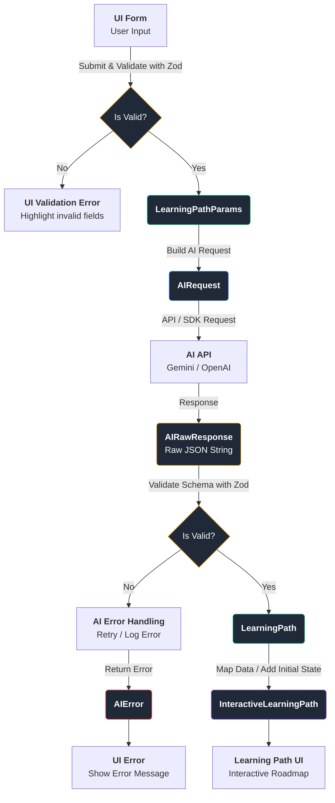

# Learning Path Data Flow & Types
## Data Flow Diagram


## Types
```ts
export type SkillLevel = 'beginner' | 'intermediate' | 'advanced';

export type WeeklyHours = '2-5' | '5-10' | '10-20' | '20+';
// NOTE: Not sure about the format yet. Will need to parse it for the prompt

export interface LearningPathParams {
  goal: string;
  skillLevel: SkillLevel;
  background?: string;
  weeklyHours: WeeklyHours;
}

// NOTE: Just an example. Actual structure depends on the AI model
export interface AIRequest {
  systemInstruction: string;
  userMessage: string;
  responseSchema: object;
}

export interface AIRawResponse {
  rawJsonString: string;
}


export interface AIError {
  code: 'AI_TIMEOUT' | 'AI_REQUEST_FAILED' | 'INVALID_JSON' | 'INVALID_SCHEMA';
  message: string;
}


export interface LearningPathStep {
  stepNumber: number;
  title: string;
  description: string;
  estimatedWeeks: number;
}


export interface LearningPath {
  id: string;
  goal: string;
  skillLevel: SkillLevel;
  totalSteps: number;
  steps: LearningPathStep[];
  createdAt: string;
}


export interface InteractiveLearningPathStep extends LearningPathStep {
  completed: boolean;
}


export interface InteractiveLearningPath extends Omit<LearningPath, 'steps'> {
  steps: InteractiveLearningPathStep[];
}
```
